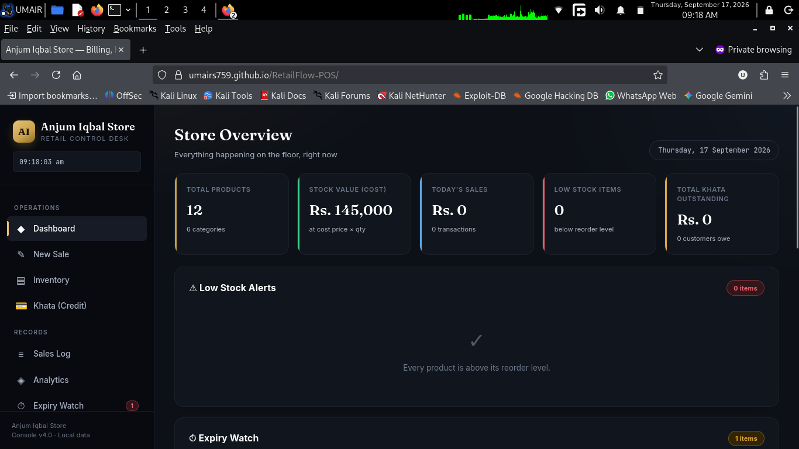
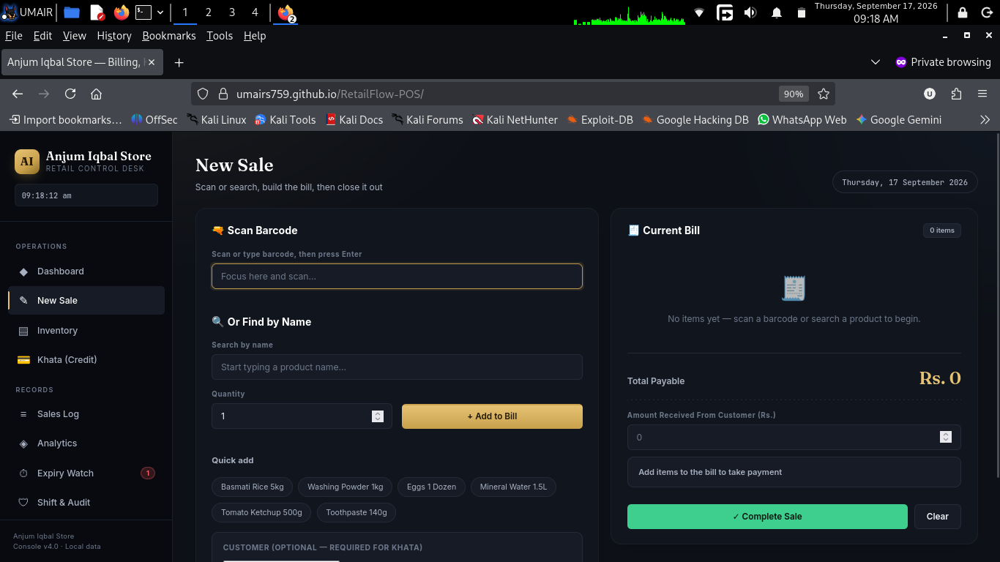
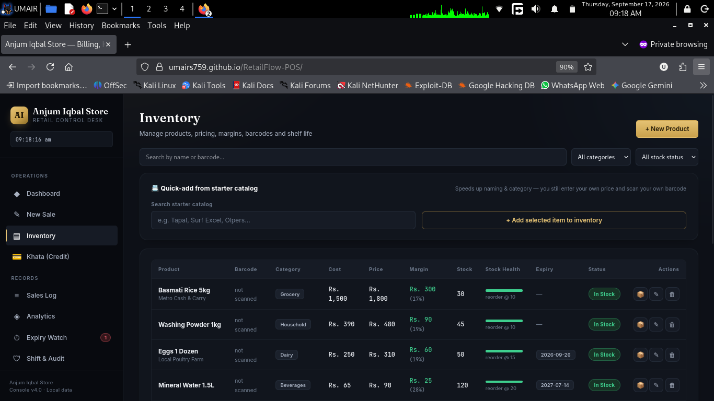

<!-- ============================================================
     RETAILFLOW POS — PROFESSIONAL README
     ============================================================ -->

<div align="center">

<!-- ░░ HERO BANNER ░░ -->


<!-- ░░ TAGLINE ░░ -->
<h3>⚡ Billing &nbsp;·&nbsp; 📒 Khata (Credit) &nbsp;·&nbsp; 📦 Inventory &nbsp;·&nbsp; 📈 Analytics &nbsp;·&nbsp; 🛡 Shift Audit</h3>

<p><em>A single-file, zero-dependency, offline-first POS built for real Pakistani shops —<br/>the kind that run on a counter, a scanner, and a prayer.</em></p>

<!-- ░░ BADGE ROW ░░ -->
<p>
  
  
  
  
  
  
</p>

<p>
  
  
  
  
  
</p>

<br/>

<a href="#-quick-start"><b>🚀 Quick Start</b></a> &nbsp;·&nbsp;
<a href="#-features"><b>✨ Features</b></a> &nbsp;·&nbsp;
<a href="#-screenshots"><b>📸 Screenshots</b></a> &nbsp;·&nbsp;
<a href="#-roadmap"><b>🗺 Roadmap</b></a> &nbsp;·&nbsp;
<a href="#-contributing"><b>🤝 Contributing</b></a>

</div>

---

## 🏪 What Is RetailFlow POS?

**RetailFlow POS** is a **single-file, browser-based Point-of-Sale console** engineered for small and medium retail shops — kiryana stores, medical stores, general stores, and family-run dukans.

It runs **entirely offline**, stores **everything locally**, and requires **zero installation, zero subscription, and zero internet**.

> 🎯 Built for shopkeepers who don't want a "software" — they want a tool that just works.

No cloud. No tracking. No monthly fee. Your shop's data stays on your shop's device.

---

## ✨ Features

<table>
<tr>
<td width="50%" valign="top">

### 🧾 Billing & Sales
- **Barcode scanning** — works with any USB/Bluetooth keyboard-wedge scanner
- **Search-as-you-type** product finder
- **Quick-add** for top sellers
- **Live change calculator** — shows exact change, khata debit, or surplus
- **Smart rounding** suggestions (Rs. 50 / 100 / 500 / 1000)
- **Thermal receipt printing** (58mm & 80mm)
- **WhatsApp receipts** — one-tap click-to-chat send

### 📒 Khata (Credit Book)
- Track every customer's outstanding balance
- **Partial payments** recorded against khata
- **Overdue reminders** at 15+ and 30+ days
- **One-tap WhatsApp recovery messages** pre-filled in polite Urdu
- Per-customer ledger with notes and history

</td>
<td width="50%" valign="top">

### 📦 Inventory Control
- Full CRUD for products, cost, price, stock
- **Profit margin** shown live per SKU
- **Reorder-level alerts** on the dashboard
- **Expiry tracking** with days-left countdown
- **Restock logger** with distributor price history
- **Starter catalog** of 40+ common FMCG items for fast naming

### 📈 Analytics & Intelligence
- **Gross profit**, revenue, avg margin — all-time
- **Top revenue** & **top quantity** products
- **Slow movers** report
- **Bundle suggestions** — pair slow movers with best sellers
- **Markdown alerts** — auto-discount for expiring stock

### 🛡 Shift & Audit
- **Open / close shift** with opening cash
- **Drawer reconciliation** — expected vs counted
- **Void / cancel** any sale (with reason logged)
- **Full audit log** of every cancelled transaction

</td>
</tr>
</table>

---

## 📸 Screenshots

> Replace these placeholders with your own screenshots after uploading to GitHub.

<div align="center">

| Dashboard | Billing Console |
|:---:|:---:|
|  |  |

| Khata (Credit Book) |
|:---:|
|  |

</div>

---

## 🚀 Quick Start

### 🥇 Option 1 — Just Open It (10 seconds)

```bash
# Download index.html
# Double-click it
```

That's it. Runs in Chrome, Edge, Firefox, Safari, Brave — any modern browser.

### 🥈 Option 2 — Host on GitHub Pages (Free, Live URL)

```bash
# 1. Push this repo to GitHub
# 2. Settings → Pages → Source → Deploy from branch → main
# 3. Your POS is live at:
https://umairs759.github.io/RetailFlow-POS/
```

---

### 🥉 Option 3 — Run Locally

```bash
# No build. No npm install. No server needed.
npx serve .
# or
python -m http.server 8080
```

---

## 🔌 Hardware Compatibility

| Device | Connection | Notes |
|---|---|---|
| 🖨 **Thermal Printer** (58/80mm) | USB / Bluetooth / Network | Uses native browser print dialog — no driver install |
| 📷 **USB Barcode Scanner** | Keyboard-wedge | Scan directly into billing — plug and play |
| 📱 **Bluetooth Scanner** | HID profile | Works on laptops, tablets, phones |
| 🖥 **Cash Drawer** | Via receipt printer | Triggered by receipt print |
| 📲 **Android Phone / Tablet** | BT scanner + OTG | Full mobile experience |

---

## 📱 Mobile-First Design

RetailFlow is **fully responsive** — designed for the counter, the pocket, and the tablet:

- 🔹 Sidebar collapses into a hamburger menu on phones
- 🔹 Touch targets sized for fingers, not cursors
- 🔹 Barcode scanning works via Bluetooth scanner or OTG
- 🔹 Same console, same features — from a 5" phone to a 27" monitor

---

## 🗂 Data & Storage

| Aspect | Detail |
|---|---|
| **Storage** | 100% browser `localStorage` |
| **Internet** | Not required — works during load-shedding |
| **Server** | None — your data never leaves the shop |
| **Cost** | Rs. 0 / month, forever |
| **Backup** | DevTools → Application → Local Storage → export, or WhatsApp daily receipts |

> 💡 **Reset to factory data:** Clear the `retailflow_pos_v4` key from Local Storage.

---

## 🎨 Design Philosophy

The interface follows a **"dark luxury retail"** aesthetic — designed so the shopkeeper feels like they're using a premium tool, not a spreadsheet.

| Element | Purpose |
|---|---|
| 🖤 **Obsidian ground** with radial gradients | Depth without noise |
| 🥇 **Brass accent** | Trust, premium quality |
| 💚 **Emerald / ❤️ Crimson** | Instant read of profit/loss, in-stock/out |
| 🔠 **Fraunces serif** | Brand moments & headings |
| 🔢 **JetBrains Mono** | Numbers feel exact — like a real ledger |
| 🧘 **Generous spacing** | Uncluttered, professional, glance-readable |

---

## 📋 Comparison — Why RetailFlow?

| Feature | **RetailFlow POS** | Basic Register | Excel Sheet | Other POS |
|---|:---:|:---:|:---:|:---:|
| Barcode scanning | ✅ | ❌ | ❌ | ⚠️ Paid |
| Khata / Udhaar tracking | ✅ | ❌ | ❌ | ⚠️ Complex |
| WhatsApp reminders | ✅ | ❌ | ❌ | ❌ |
| Expiry watch | ✅ | ❌ | ❌ | ❌ |
| Shift / drawer audit | ✅ | ❌ | ❌ | ❌ |
| Cost & profit margin | ✅ | ❌ | ⚠️ Manual | ✅ |
| Works offline | ✅ | ✅ | ✅ | ❌ |
| No monthly fee | ✅ | ✅ | ✅ | ❌ |
| Mobile-friendly | ✅ | ❌ | ❌ | ⚠️ |

---

## 🛠 Tech Stack

| Layer | Technology |
|---|---|
| **Frontend** | Vanilla HTML5, CSS3 (custom properties), JavaScript (ES6+) |
| **Fonts** | Fraunces · Inter · JetBrains Mono |
| **Storage** | `localStorage` — zero external deps |
| **Build** | None — single self-contained HTML file |
| **Deploy** | GitHub Pages · Netlify · Vercel · any static host |

> ⚡ **Loads instantly. Runs offline. Ships as one file.**

---

## 🗺 Roadmap

- [ ] **PWA / Offline install** — pin as app icon on phone
- [ ] **Cloud backup** — optional encrypted sync to Google Drive
- [ ] **Multi-store support** — manage two branches from one console
- [ ] **Supplier order sheets** — auto-generate POs from low-stock
- [ ] **Barcode label printing** — print shelf labels with price
- [ ] **Customer purchase history** — "Rashid bhai always buys X"
- [ ] **Daily profit report** — auto end-of-day summary
- [ ] **Multi-counter sync** — LAN-based peer sync (no server)

---

## 🤝 Contributing

This project is **open-source and built for real shopkeepers**. Every bug report, feature wish, and pull request makes it better.

```bash
# 1. Fork the repo
# 2. Create your branch
git checkout -b feature/amazing-feature

# 3. Commit your changes
git commit -m "Add: amazing feature"

# 4. Push and open a PR
git push origin feature/amazing-feature
```

### Ways to Contribute

- 🐛 **Report bugs** — open an issue with a screenshot
- 💡 **Suggest features** — what would make your shop run smoother?
- 🌍 **Translate** — Urdu, Sindhi, Pashto, Punjabi UI
- 📢 **Spread the word** — share with other shopkeepers

---

## ⚠️ Important Note

RetailFlow POS is a **frontend-only application**. It does **not** include:

- ❌ A backend server
- ❌ Multi-device cloud syncing
- ❌ WhatsApp Business API (uses `wa.me` click-to-chat links instead)

For a **production multi-counter deployment**, you'd need to add a server (Node.js, Firebase, Supabase, etc.). But for **95% of single-counter shops**, this is all they need.

---

## 📄 License

Released under the **MIT License** — free to use, modify, and distribute.
Credit appreciated, not required.

See [`LICENSE`](./LICENSE) for details.

---

## 🙏 Acknowledgments

Built with love for the shopkeepers who keep our economy running —
**one thela, one dukan, one khata at a time.**

---

<div align="center">

### 🚀 Deploy in 60 Seconds

```bash
git clone https://github.com/<your-username>/RetailFlow-POS.git
cd RetailFlow-POS
open index.html   # macOS
start index.html  # Windows
```

**Your POS is live at:** `https://umairs759.github.io/RetailFlow-POS/`

---

### 💬 Feedback

If you use RetailFlow in your shop, I want to hear from you:

**What worked?** &nbsp;·&nbsp; **What broke?** &nbsp;·&nbsp; **What feature would make your day easier?**

Open an issue or reach out — every suggestion shapes the next version.

<br/>

<a href="https://github.com/<your-username>/RetailFlow-POS/stargazers">
  /RetailFlow-POS?style=social" alt="Stars"/>
</a>
&nbsp;
<a href="https://github.com/<your-username>/RetailFlow-POS/network/members">
  /RetailFlow-POS?style=social" alt="Forks"/>
</a>
&nbsp;
<a href="https://github.com/<your-username>/RetailFlow-POS/issues">
  /RetailFlow-POS?style=social" alt="Issues"/>
</a>

<br/><br/>


<sub>⭐ If this project helps your shop, consider giving it a star — it helps other shopkeepers find it.</sub>

</div>
